# Automated-Real-Time-Mini-Security-Triage-Station

**Technical Project Report: Automated Real-Time Mini-Security Triage Station**

By: Lakunsin

Entry-Level Cybersecurity Analyst

July 2026

**Executive Summary**

This report documents the design, implementation, and refinement of an automated Mini-Security Triage Station deployed within a Linux environment (Ubuntu VM). The system provides Security Operations Center (SOC) style real-time analysis by bridging local OS telemetry with the Virustotal v3 API. By combining automated clipboard monitoring (xclip + Regex optimization) and real-time filesystem observation (watchdog), the triage station instantly checks copied URLs/domains and newly downloaded files against global threat intelligence databases, utilizing desktop notifications (notify-send) and an automated quarantine/deletion policy for verified malicious files.

---

**System Architecture**

This triage station relies on a combination of native Linux utilities, configuration files, and Python scripts working together:

·       **Clipboard Utility (xclip)**: A lightweight background Linux tool that allows the system to read clipboard memory. It spies on copied text so that links or domains can be automatically processed.

·       **Desktop Notification Tool (notify-send)**: A native Linux utility that generates instant desktop pop-up alerts. This is used to immediately inform the user of VirusTotal scan results without needing the terminal open.

·       **Secure Configuration File (.env)**: A hidden file used to store the private VirusTotal API key. This keeps sensitive credentials secure and separate from the source code.

·       **Python Dependencies:**

- **pyperclip**: Allows Python to interact directly with the clipboard.
- **requests**: Used to send and retrieve data from the VirusTotal API.
- **python-dotenv**: Enables Python to securely read credentials from the .env file.
- **watchdog**: Monitors the target directory for filesystem changes.

·       **The Scanning Core (scanner.py)**: The engine of the project. It handles the communication with VirusTotal, analyses URLs and file hashes, coordinates desktop notifications, and executes the auto-deletion logic.

·       **The Clipboard Watcher (clipboard_watcher.py):** A background script that continually checks the clipboard, uses a regular expression to extract URLs or naked domains and forwards them to the scanner.

·       **The Directory Observer (downloads_monitor.py)**: A background script that watches the local _~/Downloads folder_. The moment a new file is fully written to the disk, it triggers the scanning core to evaluate the file's hash.

**Phase 1: Automated Clipboard Monitoring with VirusTotal API**

**Step 1: Installing the Linux Clipboard Utility (xclip)**

To allow the background process to monitor clipboard memory and capture copied URL/links, install the lightweight clipboard manager xclip

Open the terminal and run this command to install it:
```bash
```
**sudo apt update**

**sudo apt install xclip -y**
```
```

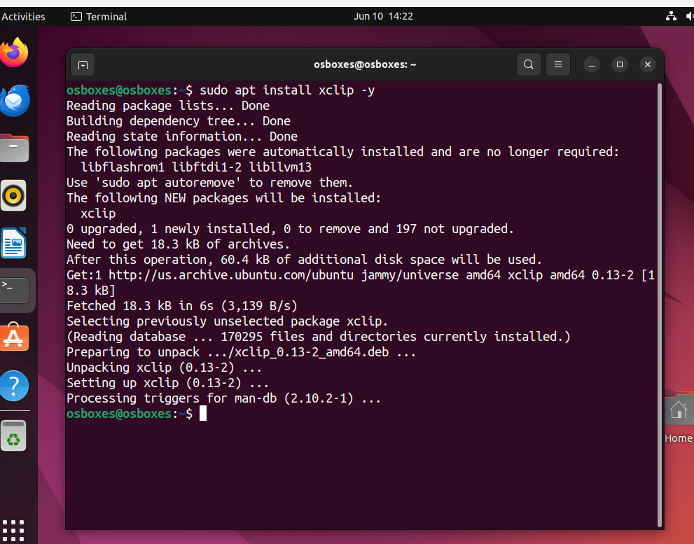

**Step 2: Installing the Desktop Notification Tool (notify-send)**

To display scan alerts on your screen in real time without relying on an open terminal window, verify that your system is equipped with notify-send

Run this command:
```bash
```
**notify-send "SOC Triage Station" "Testing desktop notification system..."**
```
```

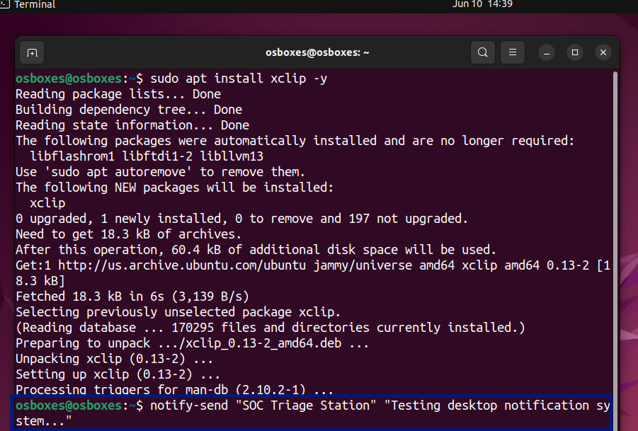

**Step 3: Create a Fresh Project Directory**

To keep the triage system organized, a dedicated project directory is created:

Run this command to create the folder and move inside it:
```bash
```
**mkdir -p ~/security_triage**

**cd ~/security_triage**
```
```
(Verify that your terminal prompt changes to show ~/security_triage before moving forward.)

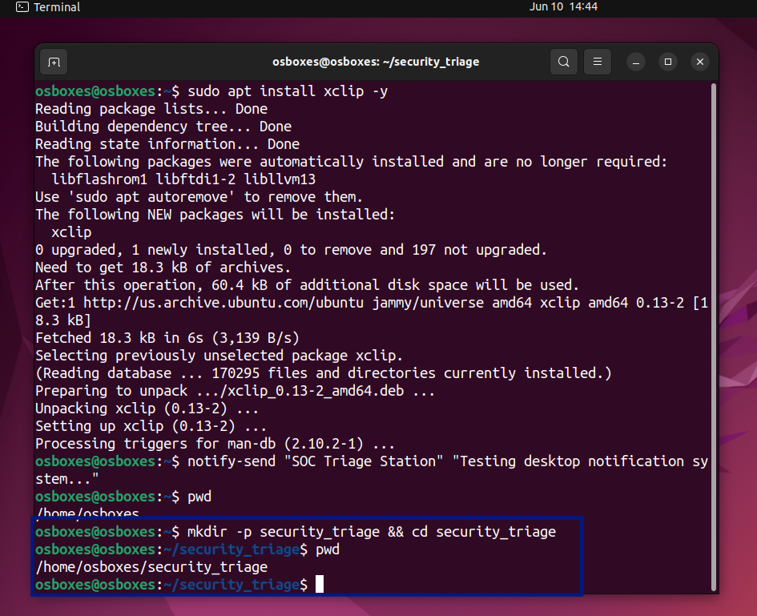

**Step 4: Create the Secure Configuration File (.env)**

To query VirusTotal safely, a private API key is required. To protect this key from exposure in your scripts, save it as an environment variable in a hidden .env file

Run this command:
```bash
```
**nano .env**
```
```
Inside the nano editor, paste your API key matching this format

**VT_API_KEY=YOUR_ACTUAL_API_KEY_HERE**

Save (Press Ctrl + O, the press Enter)

Exit (Press Ctrl + X) 

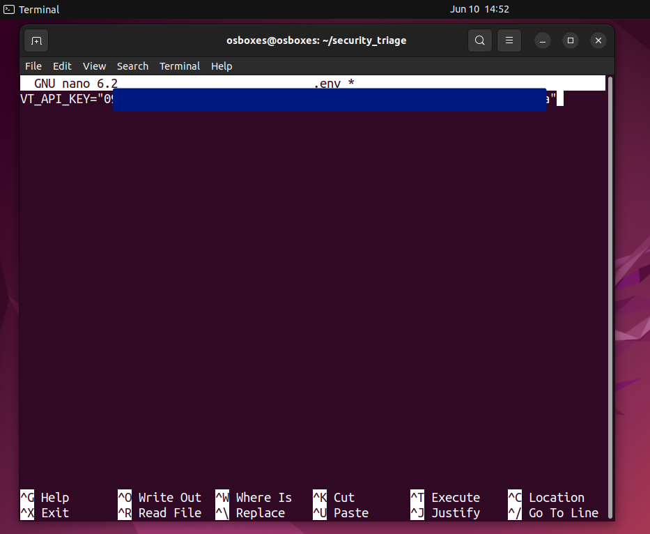

**Step 5: Install Python Dependencies**

Before running Python packages, install pip3 (the Python package installer), followed by the specific libraries needed to securely connect to the VirusTotal API

Run this:
```bash
```
**sudo apt install python3-pip -y**
```
```
Then install the Python packages:
```bash
```
**pip3 install requests python-dotenv**
```
```

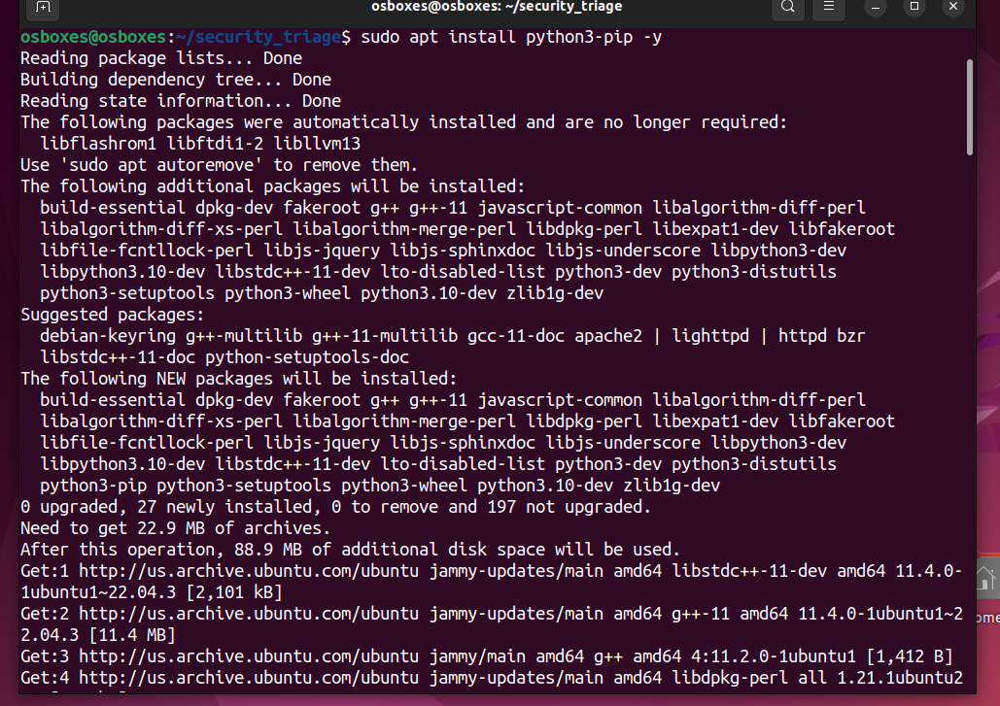

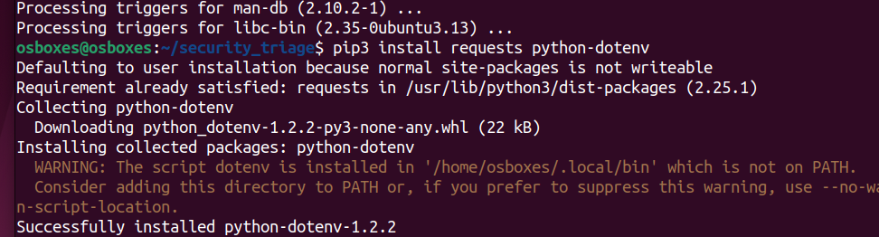

**Step 6: Create the Core Scanner Script (scanner.py)**

This Python script is designed to handle two critical tasks:

1.      Analyze a Link

2.      Analyze a file hash

It reads the .env file for your private API key, queries VirusTotal, and sends a "Safe", "Suspicious", or "Malicious" pop-up result directly to your desktop

Run this command in the terminal:
```bash
```
**nano scanner.py**
```
```
Copy the entire block of code below and paste it directly into the nano editor:
```python
```
**import os**

**import sys**

**import base64**

**import hashlib**

**import requests**

**import subprocess**

**from dotenv import load_dotenv**

**# Load API key**

**load_dotenv()**

**API_KEY = os.getenv("VT_API_KEY")**

**def notify(title, message):**

    **subprocess.run(["notify-send", title, message])**

**def check_vt(endpoint, target_id, label):**

    **if not API_KEY:**

        **notify("VT Error", "Missing API key in .env")**

        **return**

    **headers = {**

        **"x-apikey": API_KEY**

    **}**

    **url = f"https://www.virustotal.com/api/v3/{endpoint}/{target_id}"**

    **try:**

        **response = requests.get(url, headers=headers)**

        **if response.status_code == 200:**

            **data = response.json()**

            **stats = data["data"]["attributes"]["last_analysis_stats"]**

            **malicious = stats.get("malicious", 0)**

            **suspicious = stats.get("suspicious", 0)**

            **harmless = stats.get("harmless", 0)**

            **if malicious > 0:**

                **verdict = "MALICIOUS"**

                **msg = f"{label}: {malicious} engines flagged it"**

            **elif suspicious > 0:**

                **verdict = "SUSPICIOUS"**

                **msg = f"{label}: {suspicious} engines suspicious"**

            **else:**

                **verdict = "SAFE"**

                **msg = f"{label}: Clean ({harmless} engines)"**

            **notify(f"VT RESULT: {verdict}", msg)**

        **elif response.status_code == 404:**

            **notify("VT RESULT", f"{label}: Not found in database")**

        **else:**

            **notify("VT ERROR", f"Status code {response.status_code}")**

    **except Exception as e:**

        **notify("VT ERROR", str(e))**

**def scan_url(url):**

    **url_id = base64.urlsafe_b64encode(url.encode()).decode().strip("=")**

    **check_vt("urls", url_id, "URL")**

**def scan_file(path):**

    **if not os.path.exists(path):**

        **notify("ERROR", "File not found")**

        **return**

    **sha256 = hashlib.sha256()**

    **with open(path, "rb") as f:**

        **for chunk in iter(lambda: f.read(4096), b""):**

            **sha256.update(chunk)**

    **file_hash = sha256.hexdigest()**

    **check_vt("files", file_hash, "FILE")**

**if __name__ == "__main__":**

    **if len(sys.argv) < 3:**

        **print("Usage: python3 scanner.py --url <url> OR --file <path>")**

        **sys.exit(1)**

    **mode = sys.argv[1]**

    **target = sys.argv[2]**

    **if mode == "--url":**

        **scan_url(target)**

    **elif mode == "--file":**

        **scan_file(target)**
```
```
Save (Ctrl + O, Enter)

Exit (Ctrl + X)

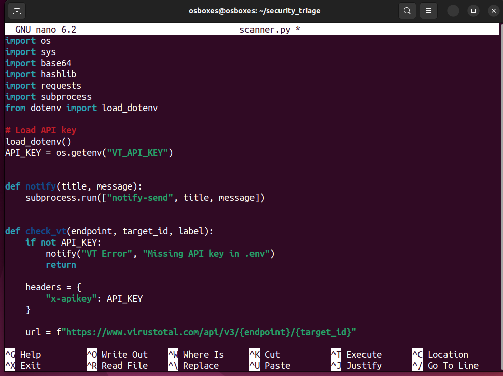

**Step 7: Test URL Scanning Manually**

Before running the background monitor, verify that scanner.py can manually reach VirusTotal and generate a desktop alert for a URL.

Run this command in your terminal:
```bash
```
**python3 scanner.py --url https://www.google.com**
```
```
**What to look for:**

·       Check your desktop for a notification from **VT RESULT: SAFE**.

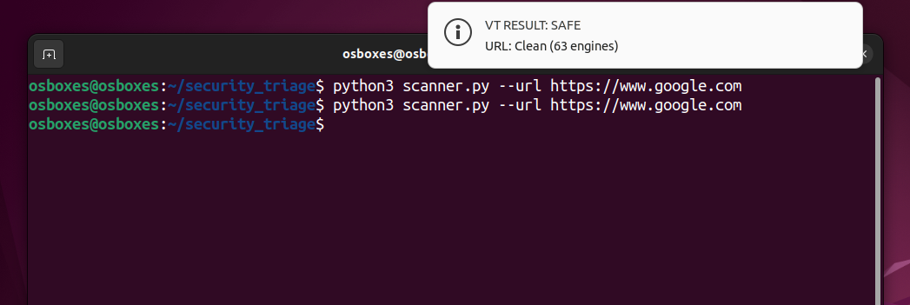

**Step 8 — Install clipboard watcher dependency**

Run this:
```bash
```
**sudo apt install xclip xsel -y**
```
```
Then install Python clipboard tool:
```bash
```
**pip3 install pyperclip**
```
```
**Why this matters**

·       pyperclip = reads anything you copy (Ctrl+C)

This is what turns the script into a real-time SOC triage agent

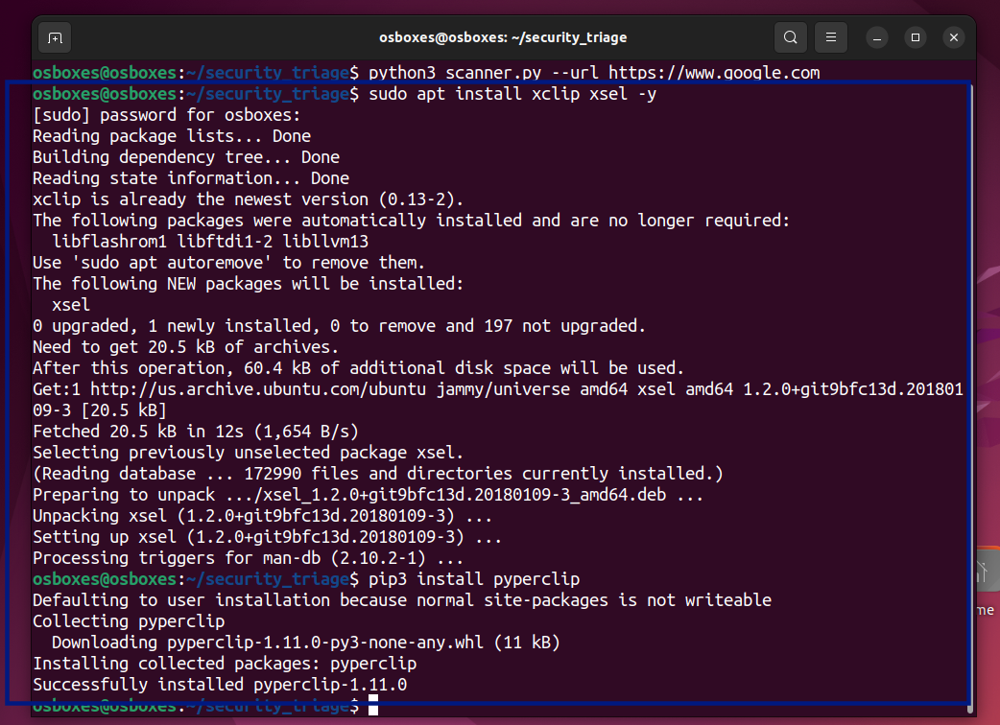

**Step 9 - Create Clipboard Monitor (Auto VirusTotal Scanner)**

This script will:

·       Watch everything you copy

·       Detect URLs automatically

·       Send them to your existing scanner.py

·       Show instant SOC-style popups

**Create the watcher file**

Run:
```bash
```
**nano clipboard_watcher.py**
```
```
Paste this code
```python
```
**import time**

**import subprocess**

**import pyperclip**

**import re**

**last_clipboard = ""**

**# simple URL detection pattern**

**url_pattern = re.compile(r"https?://[^\s]+")**

**print("Clipboard watcher running... (Ctrl+C to stop)")**

**while True:**

    **try:**

        **clip = pyperclip.paste()**

        **if clip != last_clipboard:**

            **last_clipboard = clip**

            **match = url_pattern.search(clip)**

            **if match:**

                **url = match.group(0)**

                **print(f"[+] URL detected: {url}")**

                **subprocess.run(["python3", "scanner.py", "--url", url])**

        **time.sleep(2)**

    **except KeyboardInterrupt:**

        **print("Stopped.")**

        **break**

    **except Exception as e:**

        **print("Error:", e)**

        **time.sleep(2)**
```
```
Save**:** Ctrl + O, Enter

Exit: Ctrl + X

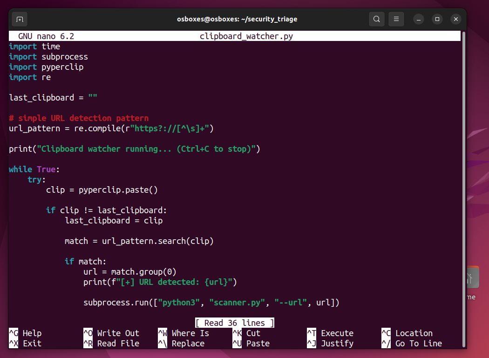

**Step 10 — Run your SOC real-time engine**

Start it in the terminal:
```bash
```
**python3 clipboard_watcher.py**
```
```
**How to test it**

1.      Copy any link like: https://example.com

2.      You should see VirusTotal popup result in the VM
Press Ctrl C to stop watcher

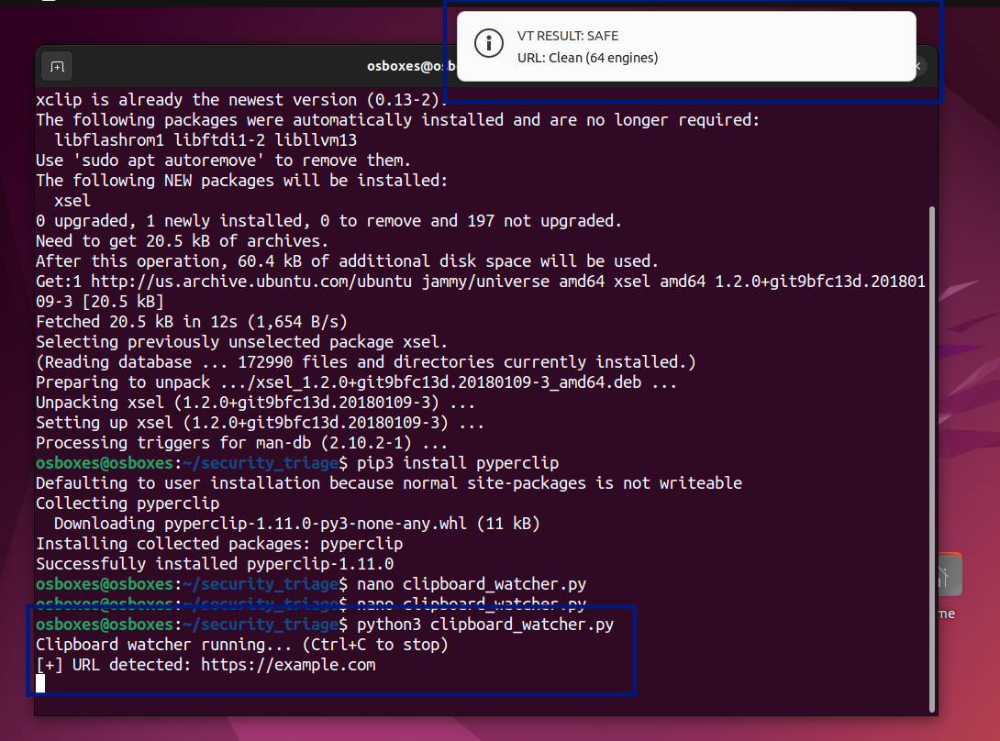

**Fixing the Detection Pattern & Enhancing Alerts**

I noticed this only works for links with https:// or http:// and the popup message didn’t display the link.

**A.**     **Fix the detection pattern**

Make the system smarter so it catches naked domains such as:

·       https://example.com 

·       paypa1.com

Open the watcher:
```bash
```
**nano clipboard_watcher.py**
```
```
Find this line:
```bash
```
**url_pattern = re.compile(r"https?://[^\s]+")**
```
```
Replace it with this:
```bash
```
**url_pattern = re.compile(r"(https?://[^\s]+|www\.[^\s]+|[a-zA-Z0-9.-]+\.[a-zA-Z]{2,})")**
```
```
Save**:** Ctrl + O, Enter

Exit: Ctrl + X

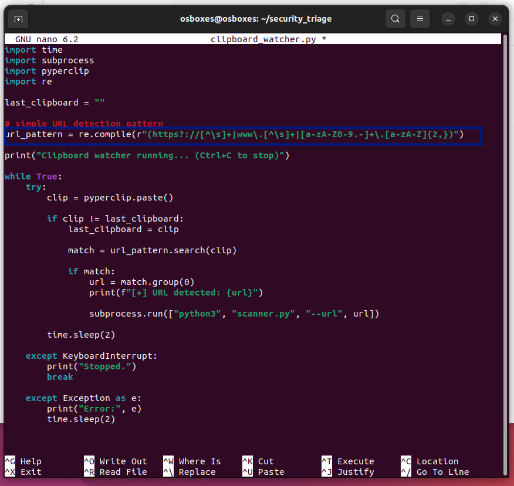

**B.**      **Notification Context**:

Modifying the desktop alert to include the tested domain/link inside the notification body.

Open the scanner file:
```bash
```
**nano scanner.py**
```
```
i.                    Under _def_ _check_vt_

Change:

**notify(f"VT RESULT: {verdict}", msg)**

To:
```bash
```
**notify(f"VT RESULT: {verdict}", f"{msg}\n\nLINK: {label}")**
```
```

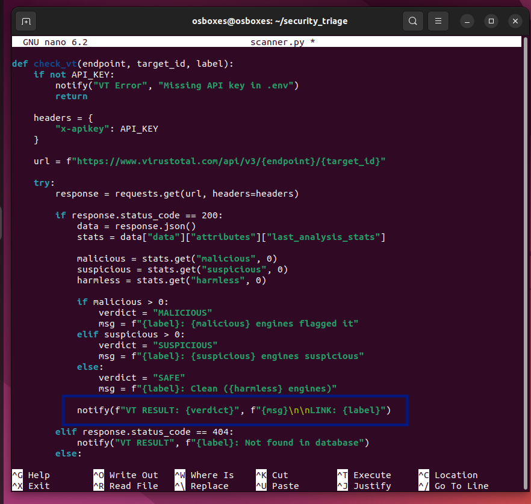

ii.                   Still under _def_ _check_vt_

Change:

**def check_vt(endpoint, target_id, label):**

To:
```bash
```
**def check_vt(endpoint, target_id, label, original_value=None):**
```
```

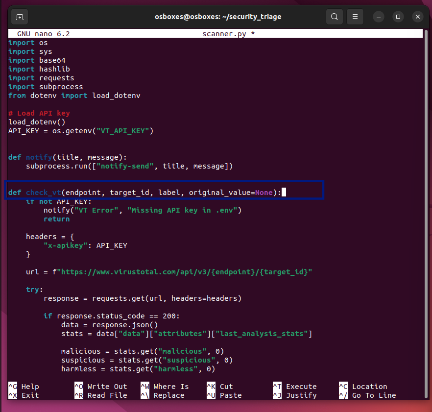

iii.                 URL part

Under _def scan URL_

Change:

**check_vt("urls", url_id, "URL")**

To:
```bash
```
**check_vt("urls", url_id, "URL", url)**
```
```

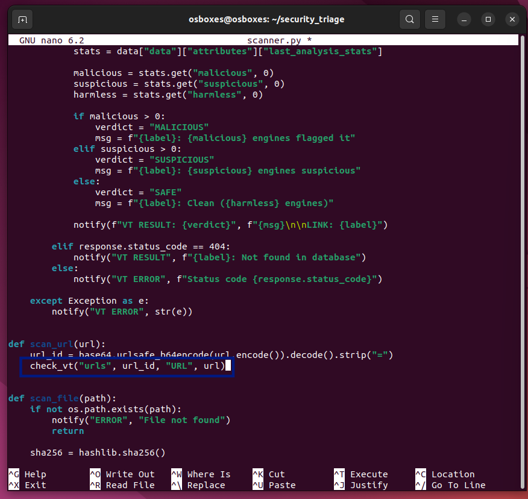

iv.                 Update notify line

Change:

**notify(f"VT RESULT: {verdict}", f"{msg}\n\nLINK: {label}")**

To:
```bash
```
**notify(f"VT RESULT: {verdict}", f"{msg}\n\nLINK: {original_value or label}")**
```
```
Save**:** Ctrl + O, Enter

Exit: Ctrl + X

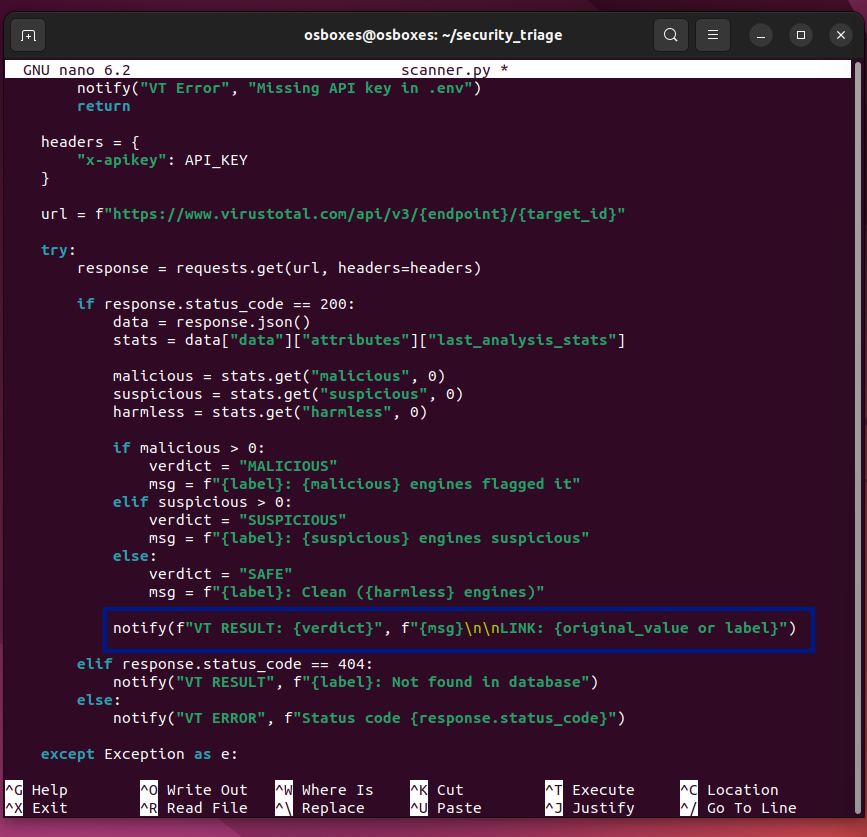

**Test the fixes**

Run the watcher:
```bash
```
**python3 clipboard_watcher.py**
```
```
Copy a naked domain and verify the link shows in the popup message.

Press Ctrl C to stop watcher.

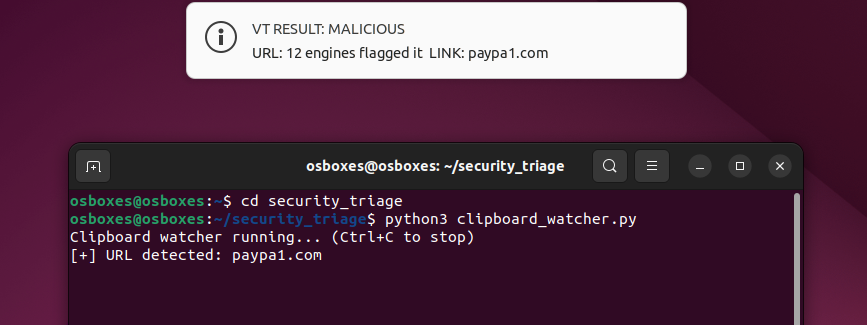

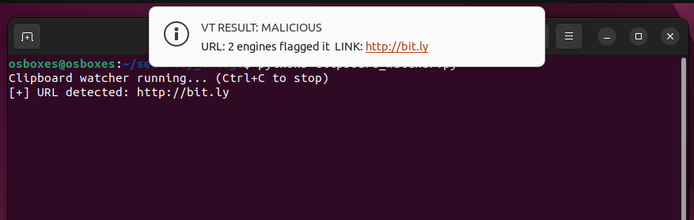

**Phase 2: File Download Monitoring and Malware Containment**

Whenever a file hits the Downloads folder, the station will hash it, scan it via Virustotal, and automatically delete it if it is flagged as malicious by 3 or more vendors.

**Step 11 — Install file monitoring tool**

Use watchdog. This allows Python to:

·       watch the Downloads folder in real time

·       detect new files instantly

·       trigger Virustotal scanner automatically

Run this:
```
```
**pip3 install watchdog**
```
```

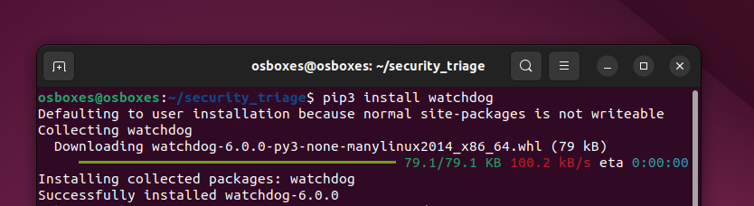

Confirm the Downloads folder exists before the next step
```bash
```
**ls ~/Downloads**
```
```
**Step 12**: **Create File Download Monitor (downloads_monitor.py)**

Now create the file monitoring script that uses watchdog to continuously observe your ~/Downloads directory for any new files.

Run this command:
```bash
```
**nano downloads_monitor.py**
```
```
Paste this code into downloads_monitor.py
```python
```
**from watchdog.observers import Observer**

**from watchdog.events import FileSystemEventHandler**

**import subprocess**

**import time**

**import os**

**DOWNLOADS = os.path.expanduser("~/Downloads")**

**class DownloadHandler(FileSystemEventHandler):**

    **def on_created(self, event):**

        **if event.is_directory:**

            **return**

        **print(f"[+] New file detected: {event.src_path}")**

        **subprocess.run([**

            **"python3",**

            **"scanner.py",**

            **"--file",**

            **event.src_path**

        **])**

**observer = Observer()**

**observer.schedule(DownloadHandler(), DOWNLOADS, recursive=False)**

**print(f"Monitoring: {DOWNLOADS}")**

**observer.start()**

**try:**

    **while True:**

        **time.sleep(1)**

**except KeyboardInterrupt:**

    **observer.stop()**

**observer.join()**
```
```
Save**:** Ctrl + O, Enter

Exit: Ctrl + X


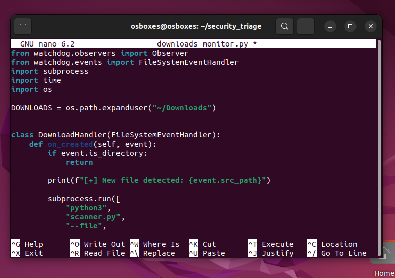

**Step 14: Start the Downloads Monitor**

Start the background watcher script to observe your ~/Downloads directory for any newly dropped files.

Run:
```bash
```
**python3 downloads_monitor.py**
```
```
You should see the startup log:

_Monitoring: /home/osboxes/Downloads_ meaning the monitor is running and watching

**Create a test file in Downloads**

Open a second terminal (leave the first terminal running).

In the second terminal, run:
```bash
```
**touch ~/Downloads/test_download.txt**
```
```
You should get this in the first terminal:

_[+] New file detected: /home/osboxes/Downloads/test_download.txt_

And a popup message showing:

_VT RESULT: SAFE_

_FILE: clean (0 engines) PATH: /home/osboxes/Downloads/test_download.txt_

Ctrl C to stop

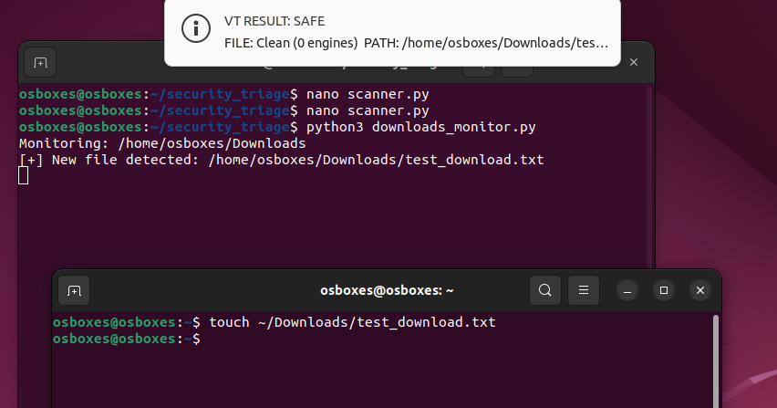

**Step 15 — Add SAFE delete function**

Add a dedicated containment function that safely handles automated file removal when a threat is identified.

a.      Open the scanner:
```bash
```
**nano scanner.py**
```
```
Add this function between _def notify() and def check_vt()_
```python
```
**def safe_delete_file(file_path, malicious_count):**

    **print(f"[DEBUG] delete called with: {file_path} | count={malicious_count}")**

    **if malicious_count is None or malicious_count < 3:**

        **return**

    **if file_path and os.path.exists(file_path):**

        **try:**

            **os.remove(file_path)**

            **# Extract just the clean file name for the deletion alert popup**

            **short_name = os.path.basename(file_path)**

            **notify(**

                **"** **⚠️  FILE DELETED",**

                **f"Malicious file removed:\n{short_name}"**

            **)**

        **except Exception as e:**

            **notify("DELETE FAILED", str(e))**
```
```

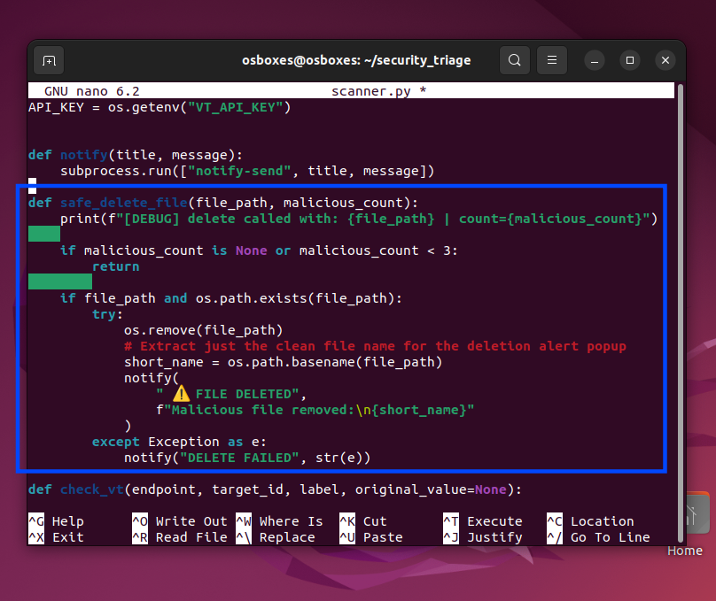

b.      Update the _check_vt_ function logic

To trigger _safe_delete_file_ whenever VirusTotal returns **3 or more malicious flags** for a scanned file. Inside the _check_vt_ function, find this exact block of code:

**if malicious > 0:**

                **verdict = "MALICIOUS"**

                **msg = f"{label}: {malicious} engines flagged it"**

Replace with
```python
```
**if malicious >= 3:**

       **verdict = "MALICIOUS"**

       **# Format clean file name for the popup if it's a file path**

       **if label == "FILE" and original_value:**

            **display_name = os.path.basename(original_value)**

       **else:**

             **display_name = original_value or target_id**

       **msg = f"{display_name}: {malicious} engines flagged it (AUTO-DELETE)"**

       **# Pass the full path to the background deletion logic**

       **safe_delete_file(original_value, malicious)**

   **elif malicious > 0:**

         **verdict = "MALICIOUS"**

         **msg = f"{label}: {malicious} engines flagged it"**
```
```
Save**:** Ctrl + O, Enter

Exit: Ctrl + X

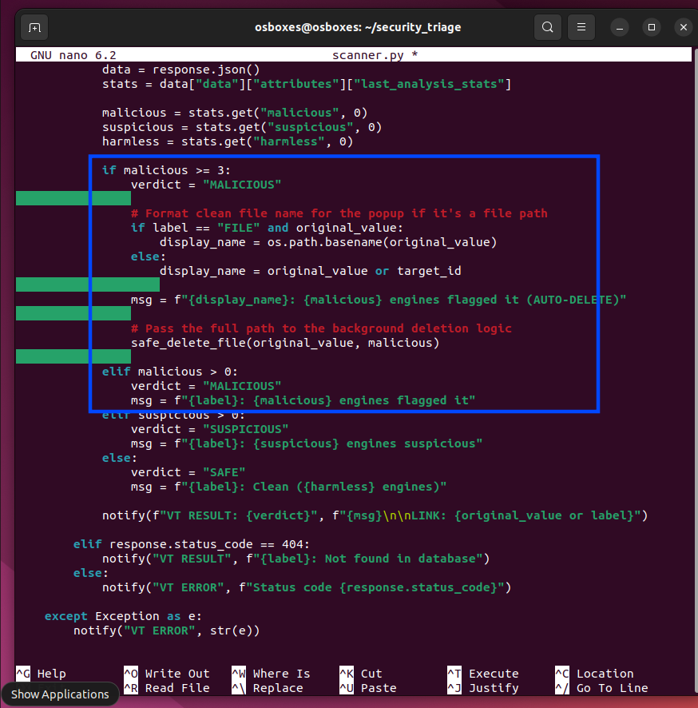

**Test**

Put the entire automated pipeline to the test using the standard, harmless EICAR anti-malware test file. This simulates downloading a malicious file to verify that your script detects, hashes, queries, and automatically deletes the threat without any manual intervention.

Start the download monitor script
```bash
```
**python3 downloads_monitor.py**
```
```
Use firefox browser or open a second terminal, Download **EICAR.COM.ZIP** from

_https://www.eicar.org/download-anti-malware-testfile/_

The terminal will show:

_[DEBUG] delete called with: /home/osboxes/Downloads/eicar_com.zip_ | count=60

The popup should show:

_FILE DELETED  
Malicious File removed: eicar_com.zip_

Press Ctrl C in Terminal 1 to stop the monitor once verified.

To confirm Virustotal flagged the hash and _safe_delete_file_ executed.

Run _ls ~/Downloads/eicar.com.txt_ in Terminal 2. It will confirm the file is gone- _No such file or directory_.

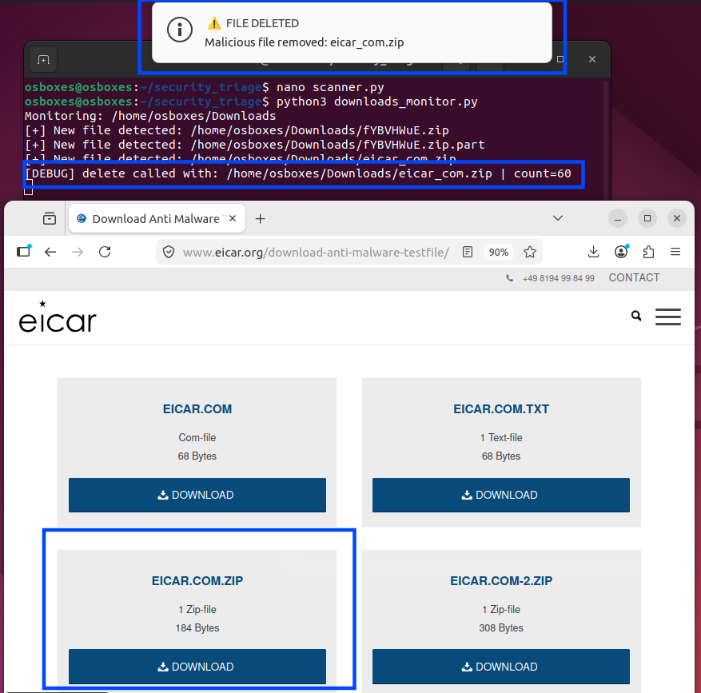

**Conclusion**

This lab brought together real-time file monitoring, Virustotal threat intelligence, and automated containment into a light EDR setup. By instantly hashing incoming downloads and deleting anything flagged as malicious, the system neutralizes threats on the spot without relying on manual checks. It turned out to be a solid, hands-on way to showcase automated incident response and endpoint defense in action.
